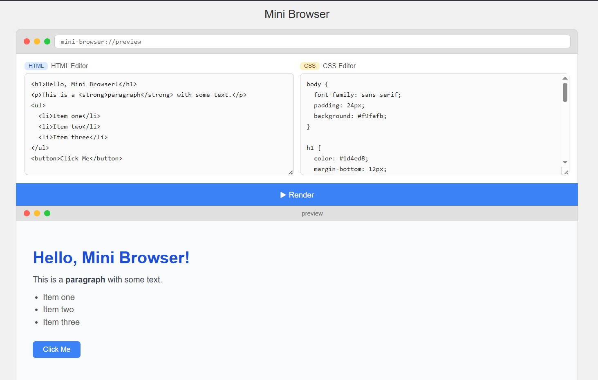

# 🌐 Mini Browser

A lightweight browser simulator built with **Vanilla JavaScript** that renders HTML and CSS in real time — no frameworks, no dependencies, just one folder.

---

## 📸 Preview



> Write HTML on the left, CSS on the right, hit **Render** and see the result instantly in the preview panel below.

---

## 🚀 Getting Started

No installation needed. Just download the files and open in any browser.

```bash
git clone https://github.com/your-username/mini-browser.git
cd mini-browser
```

Then open `index.html` in your browser — that's it!

---

## 📁 Project Structure

```
mini-browser/
├── index.html   # Main layout and structure
├── style.css    # Styling for the browser UI
└── script.js    # Render logic
```

---

## ✨ Features

- **HTML Editor** — Write any valid HTML
- **CSS Editor** — Style your HTML with basic CSS (colors, fonts, margin, padding)
- **Render Button** — Click to see your result rendered in the preview panel
- **Fake Browser UI** — Preview panel styled to look like a real browser window

---

## 🛠️ How It Works

1. User types HTML into the left textarea
2. User types CSS into the right textarea
3. On clicking **Render**, the script combines them into a full HTML document
4. The result is injected into an `<iframe>` using `srcdoc`

```js
function render() {
  const html = document.getElementById('html-input').value;
  const css  = document.getElementById('css-input').value;
  const frame = document.getElementById('preview');

  const doc = `<!DOCTYPE html>
<html>
<head>
  <meta charset="utf-8">
  <style>${css}</style>
</head>
<body>${html}</body>
</html>`;

  frame.srcdoc = doc;
}
```

---

## 🎨 Supported CSS

| Property | Supported |
|----------|-----------|
| `color` | ✅ |
| `background-color` | ✅ |
| `font-family` | ✅ |
| `font-size` | ✅ |
| `margin` / `padding` | ✅ |
| `border` | ✅ |
| `text-align` | ✅ |

> This is a **basic** CSS renderer. Advanced features like animations or grid are not in scope.

---

## 💻 Tech Stack

| Technology | Usage |
|------------|-------|
| HTML5 | Structure |
| CSS3 | Styling |
| Vanilla JavaScript | Render logic |

---

## 📄 License

MIT License — free to use and modify.
